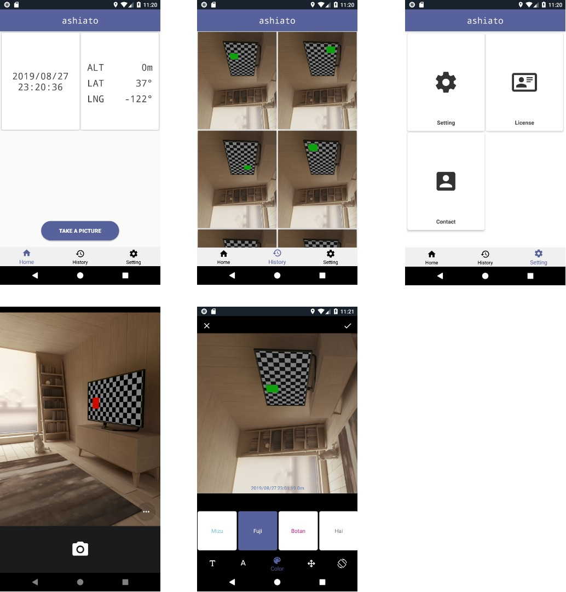

# このプロジェクトの概要
カメラで撮影した写真に日付・高さ・緯度・経度などの情報を手軽に載せられるアプリを作ってます。  
このアプリを使えば日々の写真に情報を載せて管理することができます。

# このプロジェクトの技術

このプロジェクトでは次の技術を利用しています。

* [Kotlin Programming Language](https://kotlinlang.org/)       
* [MVVM](https://ja.wikipedia.org/wiki/Model_View_ViewModel) 
* [Android Architecture Components](https://developer.android.com/topic/libraries/architecture/) 
* [Dagger2](https://github.com/google/dagger)                  

  